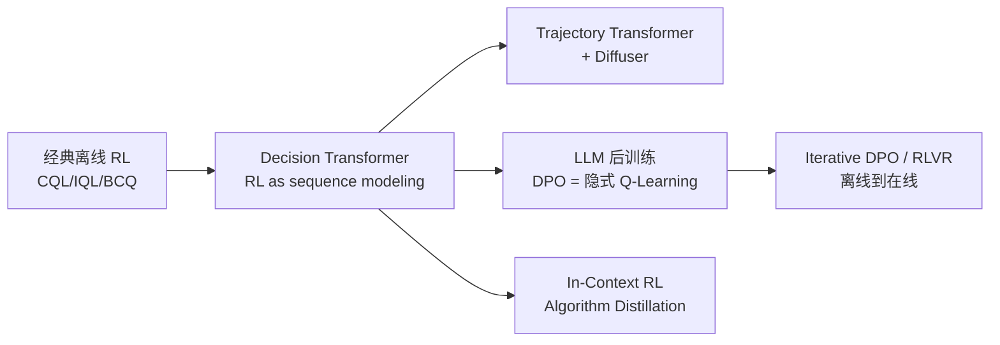

# 10.3 离线 RL 与 LLM 数据

[10.2](./sequence-modeling)把固定轨迹写成了序列建模问题。LLM 的偏好优化同样从固定数据出发：训练集已经给出提示、较好回答和较差回答，训练期间不能重新询问标注者这两个回答是否可靠。

本节先解释 DPO 与带 KL 约束的离线优化之间的联系，再把偏好数据与经典离线轨迹逐项对应，随后说明序列建模怎样进入推理搜索，最后指出这种类比能够解释什么、又不能替代什么。

## 1. 把 DPO 放回离线 RL

LLM 偏好数据与离线 RL 数据共享一个关键约束：训练只能使用已经收集好的样本，不能依靠新的环境交互立即修正分布外行为。不过，两类数据保存的反馈粒度不同，不能直接使用同一套目标函数。

### 1.1 DPO 作为隐式 Q-Learning

[第 14 章 DPO](../chapter17_dpo/intro) 推导的 DPO 目标：

$$\mathcal{L}_{\text{DPO}} = -\mathbb{E}_{(x, y_w, y_l)}\left[\log \sigma\left(\beta \log \frac{\pi_\theta(y_w \mid x)}{\pi_{\text{ref}}(y_w \mid x)} - \beta \log \frac{\pi_\theta(y_l \mid x)}{\pi_{\text{ref}}(y_l \mid x)}\right)\right]$$

这个目标写成了分类损失。Rafailov et al. 2024 在后续论文 "From $r$ to $Q^*$" 中进一步证明，DPO 的隐式奖励可以表示为带 KL 约束的 Q 函数。

定义隐式优势函数：

$$\hat{A}(x, y) = \beta \log \frac{\pi_\theta(y \mid x)}{\pi_{\text{ref}}(y \mid x)}$$

注意这里没有显式 reward model——但可以证明存在一个隐式 reward 函数 $\hat{r}(x, y) = \beta \log(\pi_\theta / \pi_{\text{ref}}) + \beta \log Z(x)$，使得 $\hat{A}$ 是该 reward 下的优势函数。进一步，定义 token-level 价值：

$$Q^*(s_t, a_t) = \hat{r}(s_t, a_t) + \gamma \mathbb{E}_{s_{t+1}}\left[\max_{a'} Q^*(s_{t+1}, a')\right]$$

DPO 损失变为：

$$\mathcal{L} = -\mathbb{E}\left[\log \sigma\left(\hat{A}(x, y_w) - \hat{A}(x, y_l)\right)\right]$$

这正是 **preferential Bradley-Terry 模型对隐式优势的 softmax 损失**。DPO 训练完成时，$\hat{A}$ 自动满足一个隐式 Bellman 方程（推导见 Rafailov et al. 2024）。这意味着：

- **DPO 是离线 RL**：训练时不与 reward model 或 environment 交互，只用固定的 $(x, y_w, y_l)$ 数据集
- **DPO 的约束**：KL 到参考模型 $\pi_{\text{ref}}$，对应离线 RL 里的"不偏离行为策略太远"
- **DPO 避开了 Q-Learning 的 max 外推路径**：它直接从偏好数据学习相对关系，并用参考策略控制更新幅度。偏好数据覆盖不足时仍会产生分布外泛化问题，因此独立评测依然必要

理解了这一对应，就能解释 LLM 后训练中许多经验现象：$\beta$ 太小 → $\pi_\theta$ 偏离 $\pi_{\text{ref}}$ 太远 → reward hacking（相当于离线 RL 中策略飞向 OOD 区域）；$\beta$ 太大 → 保守过头 → 学不到东西。这与离线 RL 中 $\alpha$ 调节 CQL 保守性的 trade-off 完全一致。

## 2. 把偏好数据看作固定数据集

把 LLM 偏好数据集和 [第 9 章](../chapter11_continuous_control/intro) 的 D4RL 离线数据集对比：

| 维度         | D4RL (MuJoCo)                             | LLM Preference Data                                    |
| ------------ | ----------------------------------------- | ------------------------------------------------------ |
| 状态 $s$     | 机器人关节角                              | prompt $x$                                             |
| 动作 $a$     | 关节力矩                                  | response $y$                                           |
| 奖励 $r$     | 标量 reward                               | 偏好 $y_w \succ y_l$（隐式 reward）                    |
| 数据来源     | 某行为策略 $\pi_\beta$                    | 人类标注 / RM 模型                                     |
| 训练目标     | $\max Q^\pi$ s.t. $\pi \approx \pi_\beta$ | $\max$ 隐式 reward s.t. $\pi \approx \pi_{\text{ref}}$ |
| 离线 RL 算法 | CQL / IQL / DT                            | DPO / IPO / KTO                                        |

这组对应关系说明，DPO 可以放在离线 RL 的视角下理解。由此也能看清 LLM 后训练为什么会借鉴离线策略约束与数据回流方法：

- **IPO（Identity Preference Optimization）**：把 DPO 的 softmax 改为 squared loss，相当于离线 RL 中改变保守正则形式
- **KTO（Kahneman-Tversky Optimization）**：用单点（非偏好对）数据训练，相当于 advantage-weighted regression
- **Iterative DPO**：多轮采集当前模型的回答再训练，使固定数据优化逐步转为 Offline-to-Online 更新
- **RLHF with PPO**：把奖励模型提供的分数作为训练反馈，并用 KL 约束限制策略偏移；它重新采样当前策略的回答，因此不再是纯离线训练

## 3. 序列模型怎样连接推理与搜索

LLM 本身就是序列模型，因此 DT 的轨迹表示可以继续用于推理与搜索任务：

- **Process Reward Model + Search**（[第 17 章](../chapter20_prm_search/inference-time-search)）：把 reasoning trajectory 当作决策序列，PRM 作为 step-level reward，beam search 类似 Trajectory Transformer
- **Expert Iteration / STaR**：用当前模型生成轨迹，过滤高奖励轨迹，再进行 SFT；它与 DT 一样依赖轨迹数据，但会通过多轮生成更新数据分布
- **In-Context RL（Algorithm Distillation, Laskin et al. 2022）**：把整个 RL 学习历史作为 prompt，让 transformer 学会"在 context 里做 RL"——直接继承 DT 的"RL as sequence modeling" 哲学

## 4. 离线视角能解释哪些后训练现象

离线 RL 提供了理解 LLM 后训练的一组工具：CQL 与 IQL 说明固定数据上的策略改进为什么需要控制分布偏移，DPO 用参考策略和偏好关系约束更新，Decision Transformer 则展示了轨迹怎样进入序列模型。这些联系为[第 11 章模仿学习与逆向 RL](../chapter13_imitation_meta_rl/bc-dagger)、[第 17 章 PRM 搜索](../chapter20_prm_search/inference-time-search)以及[第 20 章 Code World Model](../chapter23_rl_based_swe/world-model-and-deep-swe)提供了共同的数据视角。

这些方法的训练信号并不相同。经典离线 RL 通常保存逐步状态、动作和奖励；偏好优化只有回答之间的相对顺序；序列模型则依赖轨迹中已经出现的行为。把它们放在同一张图里，是为了比较固定数据怎样限制策略更新，不能把三种目标函数直接视为同一种算法。

## 本章总结

1. **固定数据会产生分布偏移**：Q-Learning 的 max 算子可能选中数据集外动作，使估值误差在多轮 Bellman 更新中累积
2. **三大保守路线**：BCQ 约束动作空间、CQL 惩罚 OOD 的 Q 值、IQL 完全规避 max；以及工程化的 BC 正则路线（TD3+BC、AWAC）
3. **Decision Transformer 采用条件序列建模**：它不使用 Bellman 更新，而是把 RTG 作为控制变量，让 Transformer 直接处理轨迹
4. **Trajectory Transformer + Diffuser** 进一步把"序列建模"推到联合轨迹分布建模与扩散生成
5. **DPO 可以从离线优化视角理解**：偏好数据是固定数据，参考策略限制更新幅度，隐式 Q-Learning 提供了一种解释其目标的方式

下一章[第 11 章模仿学习、逆向 RL 与元 RL](../chapter13_imitation_meta_rl/bc-dagger)处理另一类缺少奖励信号的设定：只观察专家行为时，怎样学习策略或推断奖励。

## 延伸阅读

- [Fujimoto et al. 2019 "Off-Policy Deep Reinforcement Learning without Exploration" (BCQ)](https://arxiv.org/abs/1812.02900)
- [Kumar et al. 2020 "Conservative Q-Learning for Offline Reinforcement Learning" (CQL)](https://arxiv.org/abs/2006.04779)
- [Kostrikov et al. 2022 "Offline Reinforcement Learning with Implicit Q-Learning" (IQL)](https://arxiv.org/abs/2110.06169)
- [Fujimoto & Gu 2021 "A Minimalist Approach to Offline Reinforcement Learning" (TD3+BC)](https://arxiv.org/abs/2106.06860)
- [Nair et al. 2020 "AWAC: Accelerating Online Reinforcement Learning with Offline Data"](https://arxiv.org/abs/2006.09359)
- [Chen et al. 2021 "Decision Transformer: Reinforcement Learning via Sequence Modeling"](https://arxiv.org/abs/2106.01345)
- [Janner et al. 2021 "Offline Reinforcement Learning as One Big Sequence Modeling Problem" (Trajectory Transformer)](https://arxiv.org/abs/2106.02039)
- [Janner et al. 2022 "Planning with Diffusion for Flexible Behavior Synthesis" (Diffuser)](https://arxiv.org/abs/2205.09991)
- [Rafailov et al. 2023 "Direct Preference Optimization: Your Language Model is Secretly a Reward Model"](https://arxiv.org/abs/2305.18290)
- [Rafailov et al. 2024 "From r to Q\*: Your Language Model is Secretly a Q-Function" (DPO 与 Q-Learning 的形式等价)](https://arxiv.org/abs/2404.12358)
- [Levine et al. 2020 "Offline Reinforcement Learning: Tutorial, Review, and Perspectives on Open Problems"](https://arxiv.org/abs/2005.01643)
- [Laskin et al. 2022 "In-Context Reinforcement Learning with Algorithm Distillation"](https://arxiv.org/abs/2210.14215)
