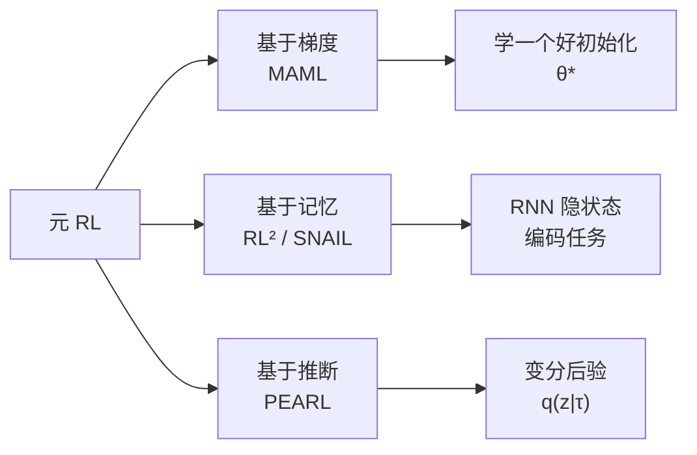
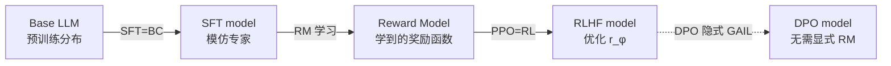

# 11.3 元强化学习与上下文适应

[11.2](./irl-gail)假设训练与部署面对的是同一个任务，只是奖励需要从专家行为中推断。元 RL 改变了这一前提：训练期间看到一组相关任务，部署时再用少量新经验适应其中一个新任务。

本节先比较 MAML、RL² 与 PEARL 的三种适应机制，再解释 Algorithm Distillation 怎样把学习过程放进上下文，随后连接 Decision Transformer 与 LLM，最后把这些概念放回 SFT、奖励模型和偏好优化流程。

## 1. 用三种机制适应新任务

固定任务上的策略只需学会一种行为。机器人换了工件、车辆进入新城市或语言模型换到新领域时，策略还要从少量新经验中判断“当前是哪一种任务”。**元 RL**（Meta-RL）在一组相关任务上训练，使模型学会这一步适应过程。

### 1.1 三种适应机制



### 1.2 MAML：学习容易适应的初始化

Model-Agnostic Meta-Learning（Finn et al. 2017）要学习一个适合继续更新的初始化 $\theta$。对每个训练任务 $T_i$，先用该任务的数据做一步内层更新：

$$\theta_i'=\theta-\alpha\nabla_\theta\mathcal L_{T_i}(\theta)$$

其中 $\alpha$ 是内层学习率，$\theta_i'$ 是适应任务 $T_i$ 后的参数。外层再检查 $\theta_i'$ 在同一任务的新数据上是否表现良好：

$$\min_{\theta} \; \mathbb{E}_{T_i \sim p(T)}\left[\mathcal{L}_{T_i}\left(\theta - \alpha \nabla_\theta \mathcal{L}_{T_i}(\theta)\right)\right]$$

因为 $\theta_i'$ 本身由 $\theta$ 计算而来，外层对 $\theta$ 求梯度时会经过内层更新：

$$\nabla_\theta \mathcal{L}_{T_i}(\theta_i') = \nabla_{\theta_i'} \mathcal{L}_{T_i}(\theta_i') \cdot (I - \alpha \nabla^2_\theta \mathcal{L}_{T_i}(\theta))$$

括号里的 Hessian $\nabla_\theta^2\mathcal L$ 会增加计算和显存。FOMAML 直接忽略这一项，把适应后参数上的梯度近似当作元梯度，从而降低成本。

```python
def maml_meta_update(meta_policy, tasks, inner_lr=0.1, outer_lr=0.001):
    meta_grad = 0
    for task in tasks:
        # === 内层：复制参数，几步 SGD 适应 ===
        theta_prime = meta_policy.params.clone()
        for _ in range(n_inner_steps):
            inner_loss = task.compute_loss(theta_prime)
            theta_prime -= inner_lr * grad(inner_loss, theta_prime)

        # === 外层：评估 adapted 参数，反传到 meta 参数 ===
        outer_loss = task.compute_loss(theta_prime)
        # 这里用 autograd 自动处理二阶梯度
        g = grad(outer_loss, meta_policy.params)
        meta_grad += g

    meta_policy.params -= outer_lr * meta_grad / len(tasks)
```

### 1.3 RL²：把任务编码进 RNN 隐状态

Duan et al. 2016 提出的 RL² 不在测试时更新参数，而是让 RNN 用隐状态记录交互历史。

设定：跨多个 episode 训练一个 RNN 策略 $\pi_\theta(a_t \mid h_t)$，其中 $h_t = f_\theta(h_{t-1}, s_{t-1}, a_{t-1}, r_{t-1}, \text{done})$。一个 episode 内的交互历史（reward、transition）通过隐状态积累，让策略在**同一任务的后几步**做出更优决策——这等价于策略在"学习"当前任务。

在同一个任务的多个 episode 之间不重置隐状态，RNN 因而可以用前几轮的状态、动作和奖励调整后续行为。参数没有变化，适应发生在隐状态中；训练目标只要求后面的 episode 获得更高回报，并不预先规定网络必须实现哪一种更新算法。

### 1.4 PEARL：显式推断任务变量

Probabilistic Embeddings for Actor-Critic RL（Rakelly et al. 2019）显式建模"任务后验"。设任务由隐变量 $z \sim p(z)$ 决定（如目标位置、摩擦系数），策略 $\pi_\theta(a \mid s, z)$ 条件于 $z$。

适应过程就是根据少量经验 $\tau$ 推断后验 $q_\phi(z\mid\tau)$，得到当前任务的嵌入 $z$。训练同时要求策略获得高回报，并限制后验不要无约束地偏离先验：

$$\mathcal{L} = -\mathbb{E}_{z \sim q_\phi}\left[\sum_t r(s_t, a_t, z)\right] + \beta \cdot D_{\text{KL}}\left(q_\phi(z \mid \tau) \,\|\, p(z)\right)$$

第一项是负回报，最小化它会提高策略表现；第二项是 KL 正则，$\beta$ 控制任务信息压缩的强度。实际适应速度取决于任务分布、上下文长度和实现，不能只由方法名称判断。

| 方法  | 适应发生在哪里              | 是否需要二阶梯度     | 测试时怎样使用新经验 |
| ----- | --------------------------- | -------------------- | -------------------- |
| MAML  | 模型参数                    | 可用，也可做一阶近似 | 做少量梯度更新       |
| RL²   | RNN 隐状态                  | 不需要               | 继续输入交互历史     |
| PEARL | 任务变量后验 $q(z\mid\tau)$ | 不需要               | 更新任务变量后验     |

### 1.5 元 RL 与 Few-Shot 学习

元 RL 与监督 few-shot learning 共享思想：**用大量相似任务训练先验，新任务上少量样本快速适应**。这一思想直接启发了 LLM 的 in-context learning——见下一节。

## 2. 把学习过程放进上下文

RL² 用隐状态承载适应过程，Algorithm Distillation（Laskin et al. 2022）则把一段完整的 RL 学习历史交给 Transformer，让模型预测学习过程中的下一步动作。

### 2.1 Algorithm Distillation 的训练数据

给定一个跨多任务的 RL 训练 run，每条轨迹 $\tau = (s_0, a_0, r_0, s_1, a_1, r_1, \ldots)$。Algorithm Distillation 的关键洞察：

> 同一次 RL 训练中，早期 episode 的回报通常较低，后期 episode 的策略逐渐改善。Transformer 若要根据前 $k$ 个 episode 预测下一动作，就必须利用历史中的状态、动作和奖励判断行为怎样随经验变化。

数据组织：

```
[episode_1 (poor policy): s0 a0 r0 s1 a1 r1 ... |
 episode_2 (slightly better): s0 a0 r0 ... |
 ...
 episode_N (expert): s0 a0 r0 ...]
            ↑
     transformer 输入：concat 所有历史
     目标：预测每个 episode 内的 next action
```

### 2.2 Algorithm Distillation 与 RL² 的差别

| 维度              | RL²                | Algorithm Distillation  |
| ----------------- | ------------------ | ----------------------- |
| 模型              | 小 RNN（LSTM/GRU） | 大 transformer          |
| 数据              | 在线 meta-training | **离线**学习历史        |
| in-context 学什么 | 任务 ID（隐式）    | **RL 算法本身**         |
| 跨算法泛化        | 单一算法           | 可蒸馏 DQN、PPO、A2C 等 |

AD 的实验关心 Transformer 能否从训练历史中恢复“获得奖励以后怎样改变动作”的规律。它模仿的是轨迹中表现出来的学习过程，泛化能力取决于训练任务和学习历史是否覆盖测试时需要的变化。

```python
def algorithm_distillation_data_generate(env, rl_algorithm, n_runs=1000, n_episodes_per_run=200):
    """收集 AD 训练数据：跨多个 run，每个 run 是一段 RL 学习过程"""
    dataset = []
    for run in range(n_runs):
        policy = init_random_policy()
        run_history = []
        for ep in range(n_episodes_per_run):
            trajectory = rollout(env, policy)
            run_history.append(trajectory)
            # 在线 RL 算法更新策略（DQN/PPO/A2C 任选）
            policy = rl_algorithm.update(policy, trajectory)
        # 每个 run 是一个训练样本：完整学习曲线
        dataset.append(run_history)
    return dataset


def ad_inference(transformer, env, n_adapt_episodes=10):
    """测试时 transformer 在新环境上 in-context 学习"""
    context = []  # 累积历史
    for ep in range(n_adapt_episodes):
        s = env.reset()
        done = False
        while not done:
            # 关键：action 由 transformer 基于 context 预测
            a = transformer.predict_next_action(context, s)
            s_next, r, done = env.step(a)
            context.append((s, a, r))
            s = s_next
        # 注意：transformer 参数不更新！只在 context 中"学习"
```

## 3. 从 Decision Transformer 连接到 LLM

### 3.1 Decision Transformer 的条件策略路线

Decision Transformer（Chen et al. 2021）更早揭示了 RL 可以转化为序列建模：把 $(R, s, a)$ 三元组喂给 transformer，$R$ 是 return-to-go。条件于目标回报 $R^*$，模型生成能达到该回报的动作。

$$a_t = \text{Transformer}\left(R_t, s_t, a_{t-1}, R_{t-1}, s_{t-1}, \ldots\right)$$

DT 不是 in-context RL——它是**条件策略**。但它启发了后续的 Online DT、Elastic DT 等，逐步与 in-context RL 合流。

### 3.2 In-Context RL 与 LLM 的连接

LLM 的 in-context learning 历史与 in-context RL 高度平行：

- **GPT-3 的 in-context learning**（2020）：在 prompt 里给几个例子，模型不更新参数就学会任务——这是**监督学习**的 in-context 版本
- **Algorithm Distillation 的 in-context RL**（2022）：在 context 里给几条带 reward 的轨迹，模型不更新参数就学会 RL——这是**强化学习**的 in-context 版本

两者都把示例或交互历史放进上下文，再预测下一步输出。是否真正实现了某种 RL 更新，需要通过新任务上的适应曲线检验，不能仅凭模型在上下文中改变回答就下结论。

## 4. 把模仿与适应放回 LLM 后训练

把前面的概念放到 LLM 训练中，可以把 SFT、奖励学习、策略优化和上下文适应分别与模仿学习、逆向 RL、前向 RL 和元学习进行比较。

### 4.1 SFT 与行为克隆

回顾 [第 13 章 RLHF](../chapter15_rlhf/base-model-to-assistant)的 SFT 损失：

$$\mathcal{L}_{\text{SFT}}(\theta) = -\sum_{t=1}^T \log \pi_\theta(y_t \mid x, y_{<t})$$

这个目标与 11.1 节的行为克隆形式相同：$(x,y)$ 是示范，$\pi_\theta$ 是待训练策略。行为克隆中的几个问题也会在自回归生成中出现：

- **分布偏移**：训练时专家状态是高质量指令-回答，部署时模型生成的下一步 token 会偏离
- **错误累积**：一旦生成 token 偏离，后续 token 在"未见过的状态"上更易出错
- **覆盖不足**：SFT 数据集无法覆盖模型部署时会访问的所有状态

RLHF 的 PPO 阶段与 DAgger 共享一个数据特征：训练信号来自当前策略实际访问的状态。区别在于，DAgger要求专家给出正确动作，PPO 使用奖励与优势更新当前动作的概率。

### 4.2 用模仿学习视角理解三阶段训练

InstructGPT（Ouyang et al. 2022）的三阶段可以重新解读为：



1. **SFT 阶段 = 行为克隆**：从人类示范学行为格式
2. **RM 阶段 = 反向 RL 的近似**：从偏好数据反推"奖励函数"——这是 LLM 版本的 MaxEnt IRL 思想（虽然具体用 Bradley-Terry 模型而非最大熵）
3. **PPO 阶段 = 前向 RL**：用学到的奖励函数做 on-policy 优化，解决 SFT 的分布偏移

[第 14 章 DPO](../chapter17_dpo/dpo-theory-and-family)可以看作 GAIL 的简化版本：DPO 的隐式奖励 $\log \pi_\theta(y_w \mid x) - \log \pi_\theta(y_l \mid x) - \log \pi_{\text{ref}}(y_w \mid x) + \log \pi_{\text{ref}}(y_l \mid x)$ 正是把"专家 vs 非专家"的判别学习内化进策略本身。

### 4.3 元 RL 视角下的 LLM 适应

LLM 的 few-shot in-context learning 可以看作"**RL² 的零样本版本**"：

- RL²：跨任务 meta-training，RNN 隐状态隐式编码任务
- LLM in-context：跨语料预训练，context window 隐式编码任务

两者都是"**不更新参数，只看 context 就能适应**"。Algorithm Distillation 揭示了 transformer 的 in-context 能力可以编码完整 RL 算法——这暗示**RLHF 训练后的 LLM 在某种程度上"内化了 RL 过程"**，能在推理时通过 context 持续改进。

### 4.4 离线模仿学习与 DPO 家族

[第 10 章 离线 RL](../chapter12_offline_rl/intro)与本章合流：当只有**专家示范 + 次优数据**时，离线模仿学习（DemoDICE、SMILe、DWBC）用保守估计避免高估次优动作，与 DPO 的"显式参考策略正则"思想同源。

### 4.5 这些对应关系的边界

模仿学习为 LLM 后训练提供了一组可以比较的结构：

- SFT 与行为克隆使用相同的条件似然目标。
- 奖励模型和逆向 RL 都从人的行为或偏好中恢复训练信号，但具体目标与数据假设不同。
- DPO 与 GAIL 都避免先训练一个独立奖励模型，二者的优化形式不能直接等同。
- In-Context RL 展示了序列模型怎样在不更新参数时利用带奖励的历史，普通 few-shot 提示并不一定执行了完整 RL 算法。

## 本章总结

模仿学习、逆向 RL、元 RL 分别回答怎样复现专家行为、怎样从示范推断奖励，以及怎样快速适应新任务。

1. **行为克隆（BC）** 把模仿学习当作监督学习，但受**分布偏移**困扰；**DAgger** 通过迭代收集失败状态修复
2. **MaxEnt IRL** 从专家示范反推奖励函数，但配分函数 $Z$ 计算昂贵
3. **GAIL** 用 GAN 对抗训练隐式表达奖励，是 LLM 时代 DPO 的理论前身
4. **元 RL** 学习"如何快速学习"：MAML 学好初始化、RL² 把算法压缩进 RNN、PEARL 显式推断任务后验
5. **In-Context RL / Algorithm Distillation** 把整个 RL 算法蒸馏进 transformer 的 in-context 能力，连接到 LLM 的 few-shot 学习
6. **LLM 后训练**可以借助 BC、逆向 RL 与前向 RL 的概念理解 SFT、奖励模型和 PPO；DPO 与 GAIL 都把偏好区分信号直接用于策略学习，但训练目标不同

下一章 [第 12 章 探索、MARL 与分层 RL](../chapter14_exploration_marl_hierarchical/intro) 转向另外三个进阶主题：当奖励稀疏时如何探索、当多个智能体互动时如何训练、当 horizon 极长时如何分层规划。

## 延伸阅读

- [Pomerleau 1989 "ALVINN: An Autonomous Land Vehicle in a Neural Network"（最早的 BC）](https://www.ri.cmu.edu/publications/alvinn-an-autonomous-land-vehicle-in-a-neural-network/)
- [Ross, Gordon & Bagnell 2011 "A Reduction of Imitation Learning and Structured Prediction to No-Regret Online Learning"（DAgger）](https://arxiv.org/abs/1011.0686)
- [Ziebart et al. 2008 "Maximum Entropy Inverse Reinforcement Learning"](https://www.aaai.org/Papers/AAAI/2008/AAAI08-227.pdf)
- [Ho & Ermon 2016 "Generative Adversarial Imitation Learning"（GAIL）](https://arxiv.org/abs/1606.03476)
- [Finn, Abbeel & Levine 2017 "Model-Agnostic Meta-Learning for Fast Adaptation of Deep Networks"（MAML）](https://arxiv.org/abs/1703.03400)
- [Duan et al. 2016 "RL²: Fast Reinforcement Learning via Slow Reinforcement Learning"](https://arxiv.org/abs/1611.02779)
- [Rakelly et al. 2019 "Efficient Off-Policy Meta-Reinforcement Learning via Probabilistic Context Variables"（PEARL）](https://arxiv.org/abs/1903.08254)
- [Laskin et al. 2022 "In-Context Reinforcement Learning with Algorithm Distillation"](https://arxiv.org/abs/2210.14215)
- [Chen et al. 2021 "Decision Transformer: Reinforcement Learning via Sequence Modeling"](https://arxiv.org/abs/2106.01345)
