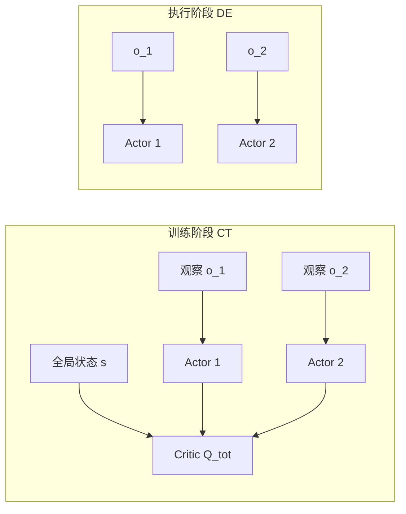

# 12.2 多智能体强化学习

[12.1](./intro)假设只有一个智能体，它需要解决的是怎样找到稀疏奖励。多个智能体同时学习时，问题又多了一层：对某个智能体来说，其他智能体的策略不断变化，因此同一个动作的后果也会变化。

本节先形式化这种非平稳性，再介绍 CTDE 怎样分开训练信息与执行信息，随后推导 MADDPG 的集中式 Critic，最后看 MAPPO 怎样用 PPO 的裁剪更新稳定多个策略。

## 1. 多智能体为什么使环境变得非平稳

当环境里有多个智能体同时学习，从智能体 $i$ 的视角看，下一状态不仅取决于自己的动作 $a_i$，还取决于其他智能体的联合动作 $a_{-i}$。其他策略更新以后，即使 $s$ 和 $a_i$ 相同，下一状态分布也可能改变。旧数据因此更快过时，独立 Q-Learning 的学习目标会不断移动。

### 1.1 从正则形式博弈到多智能体 RL

最简洁的多智能体形式化是**正则形式博弈**（Normal-Form Game）：联合动作 $a = (a_1, \ldots, a_n)$，每个智能体有自己的奖励 $r_i(a)$。纳什均衡是没有任何智能体能单方面改变策略提升期望收益的联合策略。但博弈论解法假设对手理性且模型已知，深度 MARL 要面对的是高维观察、未知奖励、对手也在学习。

## 2. 用 CTDE 分开训练与执行

**Centralized Training Decentralized Execution** 是工业界最实用的折衷方案。训练时所有智能体的观察和动作都可见，critic 可以接入全局信息；执行时每个智能体只能看自己的观察，actor 必须分散决策。

形式上，分散策略 $\pi_i(a_i \mid o_i)$ 只依赖局部观察 $o_i$，而集中式 critic $Q_i^{\text{tot}}(s, a_1, \ldots, a_n)$ 依赖全局状态和联合动作。这同时满足两个约束：

- **训练信号丰富**：critic 看全局，规避了"对手当环境"的非平稳性
- **执行可行**：actor 只看局部，部署到真实多机系统时无需通信



CTDE 下常见三类方法：VDN、QMIX 等价值分解方法，MADDPG、MAPPO 等 Actor-Critic 方法，以及 CommNet、TarMAC 等显式通信方法。下面先看两个 Actor-Critic 代表。

## 3. 用 MADDPG 学习集中式 Critic

### 3.1 每个智能体怎样更新自己的 Actor

Multi-Agent DDPG（Lowe et al. 2017）直接把 DDPG 扩展到多智能体设定。每个智能体 $i$ 持有自己的 Actor $\mu_{\theta_i}(o_i)$ 和集中式 Critic $Q_i(o_1,a_1,\ldots,o_n,a_n)$。Actor $i$ 的更新需要知道：自己的动作稍微改变时，Critic 预测的回报会怎样变化。链式法则给出：

$$\nabla_{\theta_i} J(\mu_{\theta_i}) = \mathbb{E}\left[\nabla_{\theta_i} \mu_{\theta_i}(o_i) \cdot \nabla_{a_i} Q_i(o_1, a_1, \ldots, o_n, a_n)\big|_{a_i = \mu_{\theta_i}(o_i)}\right]$$

右边第一项表示参数变化会怎样改变 Actor 输出，第二项表示动作变化会怎样改变 Critic 的估值。相乘后，梯度就能把 Critic 的评价传回 Actor。更新 Actor $i$ 时只对 $a_i$ 求导，其他动作作为这批数据中的已知条件。Critic 输入会随智能体数量增长，因此这种写法在智能体很多时成本较高。

```python
class MADDPG:
    def __init__(self, n_agents, obs_dim, action_dim):
        # 每个智能体一组 actor + 集中 critic
        self.actors = [Actor(obs_dim, action_dim) for _ in range(n_agents)]
        self.critics = [Critic(n_agents * (obs_dim + action_dim), 1)
                        for _ in range(n_agents)]

    def update(self, batch):
        obs, actions, rewards, next_obs = batch  # 所有智能体的轨迹
        for i in range(self.n_agents):
            # 集中 critic target：所有智能体的下一动作
            next_actions = [self.actors_target[j](next_obs[j])
                            for j in range(self.n_agents)]
            target_q = self.critics_target[i](
                torch.cat([*next_obs, *next_actions], -1))
            y = rewards[i] + self.gamma * target_q
            # critic 拟合 y
            current_q = self.critics[i](
                torch.cat([*obs, *actions], -1))
            critic_loss = F.mse_loss(current_q, y.detach())

            # actor 只对自己的动作求梯度
            pred_action_i = self.actors[i](obs[i])
            all_actions = list(actions)
            all_actions[i] = pred_action_i
            actor_loss = -self.critics[i](
                torch.cat([*obs, *all_actions], -1)).mean()
            ...
```

MADDPG 的弱点：(1) 集中 critic 的输入维度随智能体数爆炸，几十个智能体时不可行；(2) DDPG 系列的稳定性问题（见 [第 9 章](../chapter11_continuous_control/intro#_12-3-td3-ddpg-的稳定性补丁)）全部继承。

## 4. 用 MAPPO 稳定更新多个策略

Multi-Agent PPO（Yu et al. 2022）把 PPO 的 on-policy actor-critic 扩展到 CTDE：每个智能体一个分散 actor $\pi_{\theta_i}(a_i \mid o_i)$，共享一个集中 critic $V_\phi(s)$（或带联合动作输入的 $Q_\phi$）。PPO 的 clip 目标天然适用于多智能体，因为策略比 $\pi_{\theta_i}/\pi_{\theta_i}^{\text{old}}$ 是每个智能体独立计算的，clip 防止单智能体策略跳得太远导致联合分布崩溃。

```python
def mappo_update(actors, critic, buffer, n_agents, clip_eps=0.2):
    for epoch in range(E):
        for batch in buffer.iter():
            s, obs_list, a_list, old_logp_list, adv, ret = batch
            # 集中 critic：估 V(s)
            values = critic(s)
            new_logp_list = [log_prob(actors[i](obs_list[i]), a_list[i])
                             for i in range(n_agents)]
            for i in range(n_agents):
                ratio = (new_logp_list[i] - old_logp_list[i]).exp()
                s1 = (ratio * adv[i]).mean()
                s2 = torch.clamp(ratio, 1 - clip_eps, 1 + clip_eps) * adv[i]
                policy_loss = -torch.min(s1, s2).mean()
                entropy_bonus = -new_logp_list[i].mean()
                update(actors[i], policy_loss + 0.01 * entropy_bonus)
            value_loss = F.mse_loss(values, ret)
            update(critic, value_loss)
```

MAPPO 因为训练稳定、实现清楚，常被用作合作型多智能体任务的强基线：

- **稳定性**：PPO 的 clip 比 DDPG 的 off-policy 更新更鲁棒
- **超参复用**：相近的配置可以用于 _StarCraft Multi-Agent Challenge_、_Hanabi_ 与 _Multi-Agent MuJoCo_ 等任务
- **扩展性**：critic 共享、actor 可分布式训练，适合大集群

### 4.1 比较常见的 CTDE 算法

| 算法            | critic 输入                | actor 输入 | on/off-policy | 代表任务      |
| --------------- | -------------------------- | ---------- | ------------- | ------------- |
| IQL（独立学习） | $o_i$                      | $o_i$      | off           | 弱基线        |
| VDN / QMIX      | $s$（线性/单调分解）       | $o_i$      | off           | 合作任务      |
| MADDPG          | $(o_1,a_1,\ldots,o_n,a_n)$ | $o_i$      | off           | 合作-竞争混合 |
| MAPPO           | $s$                        | $o_i$      | on            | SMAC、Hanabi  |

### 4.2 价值分解解决什么问题

VDN 假设 $Q_{\text{tot}} = \sum_i Q_i(o_i, a_i)$，QMIX 推广为 $Q_{\text{tot}}$ 是各 $Q_i$ 的单调函数（保证 $\arg\max$ 可分解）。它们也是 CTDE，但属于"价值分解"分支，不在本章主线。MAPPO 在大多数合作任务上已超过 QMIX。

## 本节总结

多智能体 RL 的主要困难是非平稳性：其他智能体的策略变化会改变单个智能体观察到的转移。CTDE 在训练时让 Critic 使用全局信息，执行时仍由各个 Actor 独立决策。MADDPG 使用异策略确定性更新，MAPPO 使用 On-Policy 裁剪更新；后者常作为 StarCraft 多智能体微操等合作任务的强基线。

下一节 [12.3 分层强化学习与世界模型](./hierarchical)处理长程任务，说明高层子目标与低层动作怎样缩短奖励传播距离。
