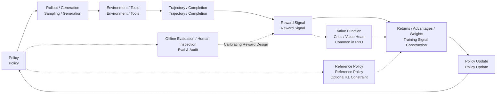

# A.1 Training Debugging Guide

The main text provides the core of algorithms, training paradigms, and system capabilities. Practical training also requires a set of reusable diagnostic methods to translate metrics such as reward, KL divergence, entropy, length, and gradient into specific issues. This appendix begins with a training debugging guide, followed by supplementary content on training systems, Agent sandboxes, evaluation benchmarks, core implementations, and mathematical tools.

> After learning RL algorithms, you will realize that **the real challenge is not the algorithm, but the engineering**. The model can't fit on a single card, training runs for a whole day with loss still increasing, and evaluation scores are completely off from expectations—these issues are not covered in any RL textbook, but you will encounter them every day in practice.
>
> Each section of this appendix addresses only one thing. You can jump to the relevant section as needed.

## Structure of This Appendix

| Section                                                                                | Topic                                            | What It Solves                                                                                                           |
| -------------------------------------------------------------------------------------- | ------------------------------------------------ | ------------------------------------------------------------------------------------------------------------------------ |
| [A.2 RL Training System: Sampling, Asynchronous, and Distributed](./rl-infrastructure) | How to Run an RL Training System                 | Sampling bottlenecks, rollout engine, asynchronous training, weight synchronization, DP/TP/PP/EP                         |
| [A.3 Agentic RL Infrastructure](./agentic-rl-infra)                                    | What Infrastructure is Needed for Agentic RL     | Sandbox, trajectory storage, tool execution, multi-turn scheduling, Relax case                                           |
| [A.4 RL Post-Training and Agentic RL Benchmark](./evaluation-badcase)                  | How to Know if the Model and Agent Have Improved | Post-training evaluation, Agentic benchmark, training monitoring, Badcase attribution, and go-live gate                  |
| [C.3 Large Model RL Training Metrics Glossary](./metrics-glossary)                     | What Do the Metrics in Training Logs Mean        | PPO/GRPO/DPO/RM training metrics grouped by function, including abnormal signals and framework differences               |
| [C/F.4 Industrial Exercises](./industrial-exercises)                                   | Post-Training and RL Job Competencies            | Dissecting real work, competency maps, and 8 industrial exercises based on job requirements in China, the US, and Europe |

## Reading Suggestions

- **If you are working on LLM fine-tuning**: Read in the order of A.2 → A.4 → C.3
- **If you are working on Agentic RL**: Read in the order of A.2 → A.3 → A,4
- **If you are working on game/robot RL**: Focus on the non-LLM RL part of A.2 and the monitoring section of A.4
- **If you are preparing for an interview**: Directly read C.4 for practice, and go back to previous sections if you encounter blind spots
- **If you are looking up the meaning of metrics**: Directly read [C.3 Metric Glossary](./metrics-glossary), and refer to it as needed

You have already written DQN, Actor-Critic, and PPO, and you have read through the training processes of RLHF, GRPO, and Agentic RL. At this point, a very natural question arises:

> Why does the same algorithm run in the paper and in others' code, but when you change the environment, switch the reward, or scale up the model, it becomes unstable?

This is not just your problem. The difficulty of reinforcement learning has never been just about "whether you can derive the formulas" — the real challenge lies in the training process itself, which is a closed loop that changes the data distribution in reverse: the policy changes, the sampled data changes, the reward model may be biased, and the value function is chasing a moving target. In supervised learning, a single batch error typically only affects one gradient update; in RL, a bad policy collects bad data, and the bad data trains out an even worse policy.

Therefore, this appendix is not a "common error list," nor does it only cover four failure modes. It is a lesson in debugging: we first build a mental model, and then follow this model to examine various training anomalies.

After completing this section, you should be able to answer three questions:

1. When the training curve is problematic, which part should you suspect first?
2. What is the relationship between the following metrics: Reward, Loss, KL, Entropy, Value Loss, GPU memory usage, and evaluation scores?
3. How can you systematically troubleshoot an unstable RL experiment, rather than randomly tweaking hyperparameters by intuition?

## Looking at Training from a Closed Loop Perspective

Let's draw an abstract closed loop. Note that this is not a specific implementation diagram of a particular framework, nor does it mean that all modern LLM RL systems must look like this; it's simply a tool to help you understand that a typical RL training process generally involves the following stages: "generate behavior → score → construct training signal → update policy."



In this diagram, any single component failing can ultimately result in "reward not increasing." However, the solutions to these issues are entirely different.

Here, we need to distinguish three things.

**Reward Signal** is the actual score computed during training. It may come from the environment itself, a hand-written reward function, a reward model, a verifier, or a weighted combination of several rules.

**Training Signal Construction** is the process of turning the reward into "what should be encouraged and what should be suppressed in this update." In PPO / Actor-Critic, this is typically represented as return, value target, and advantage. The advantage can be roughly understood as "how much better this action or response is compared to the current expectation." If the actual return is higher than the critic's estimated value, the advantage is positive, and the policy will be more inclined to repeat this behavior; conversely, it will be suppressed. In GRPO / RLVR, a common approach is not to train a critic but instead to sample multiple responses to the same prompt, using the relative rewards within the group to construct advantage-like training weights. The TRL GRPO documentation also breaks down the process into generation, computing advantage, estimating KL, and computing loss, but the advantage here comes from the normalization of within-group rewards, not from the critic's prediction[^trlgrpo].

**Evaluation and Manual Sampling** are forms of side supervision. They are used to select checkpoints, detect reward hacking, and decide whether to roll back, but they do not directly enter the gradient update process under normal circumstances. Evaluation results can alert you that "the reward design is wrong," but they are not equivalent to the reward signal during training.

Therefore, this diagram is more suitable as a "unified debugging map," rather than the sole flow of modern Agentic RL. PPO-RLHF would resemble the "Critic + KL" version in the diagram; GRPO/RLVR would be closer to the "multiple generations + reward/verifier + intra-group relative advantage" version; Agentic RL extends a single response into a multi-step tool trajectory, with rewards possibly coming from the final environment state, a rule-based verifier, or human/model review. If the environment wiring is wrong, adjusting the learning rate won't help; if the reward function is being exploited, further training will only make the model better at cheating; if the Critic is not trainable, the PPO advantage will become noise; if KL divergence surges, it indicates the policy has left the trusted region; and if the evaluation protocol is corrupted, all the beautiful curves may be just illusions.

::: tip Remember this one sentence
The first principle of RL debugging is not "tuning parameters," but "identifying which part of the feedback loop is broken first."
:::

## Initial Diagnosis of Training Anomalies

When training anomalies occur, the most common approach is to immediately adjust hyperparameters. For example, reducing the learning rate, increasing the batch size, increasing the KL coefficient, or training for more steps. This seems proactive, but it introduces new variables, making the original problem harder to identify.

This section introduces a more suitable initial diagnostic process for course experiments and research reproducibility. Its goal is not to immediately fix the training but to first determine the source of the anomaly: experimental configuration, evaluation protocol, reward signal, model output, or the optimization process itself.

### Recording Experimental Context

First, record the basic context of this experiment, including the configuration file, random seed, code version, checkpoint, training logs, and evaluation commands. Reinforcement learning experiments are highly sensitive to random seeds and implementation details. The same algorithm setting may exhibit significant differences under different seeds[^drltm]. If these information is not saved, subsequent analysis will have difficulty distinguishing between "the algorithm is inherently unstable" and "the experimental conditions have changed."

### Distinguishing Training Metrics from Evaluation Metrics

Training reward only indicates that the model is optimizing a certain reward signal, and cannot directly reflect an improvement in task performance. A more reliable way to observe is to distinguish three types of information:

- **Training Metrics**: For example, training reward, policy loss, KL divergence, entropy, etc., used to observe whether the optimization process is stable.
- **Evaluation Metrics**: For example, held-out benchmark, private test set, task success rate, etc., used to determine whether the model's capability has improved.
- **Behavioral Samples**: The actual outputs of the model or agent, used to determine whether it has learned incorrect patterns.

For example, in RLHF training, if the reward increases while the evaluation score remains unchanged, and the response length continues to increase, this should not be interpreted as "the training is not long enough," but rather as a suspicion that the reward signal contains a preference for length.

### Checking Model Output Samples

Curves are a compressed representation of the training process, while samples can reveal specific behaviors. When diagnosing, at least three types of samples should be checked: high reward samples, low reward samples, and random samples from the latest checkpoint.

In language model training, reward hacking often first manifests as a change in text style: responses become longer, more complex in format, and include more polite language, but with a decrease in information density. In Agentic RL, it may also manifest as an increase in the number of tool calls, but the final environment state does not truly complete the task.

### Constructing a Minimal Reproduction Experiment

After verifying the logs and samples, the experiment should be reduced to a version that can be run quickly: a smaller model, smaller batch size, fewer prompts, and fewer training steps. The minimal reproduction experiment does not aim for the final performance score, but rather answers the fundamental questions:

- Can the implementation learn under simple settings?
- Does the reward have discriminative power?
- Is the evaluation protocol stable?
- If using PPO/Actor-Critic, can the value function fit a fixed rollout?
- If using GRPO/RLVR, is the reward ranking of multiple responses for the same prompt reasonable?

Many RL errors do not immediately cause the program to crash. For example, a mistake in the `done` mask, a reward sign error, a padding token participating in the loss, or a change in the evaluation temperature, may allow the training to end normally, but the model may learn incorrect behaviors. Therefore, completing a minimal reproduction before large-scale training is a very important step in the debugging process.

## Diagnosis Order

The following sections will discuss different types of training issues separately. When diagnosing in practice, it is recommended to follow an order from the outside in.

First, check the environment and data. Is the state the agent sees correct? Are the actions being executed correctly by the environment? Are the termination signals handled properly? Is the reward sign as expected? If there is an error at this level, subsequent algorithm updates are merely optimizing on incorrect data.

Next, check the evaluation protocol. If settings such as sampling temperature, maximum output length, tool permissions, and test set division change, the evaluation results cannot be directly compared. Public test sets that are repeatedly used for hyperparameter tuning will gradually lose their evaluation significance.

Then, check the reward signal. Is the reward too sparse? Are there extreme high-score samples? Is the reward signal consistent with human judgment or independent evaluation? If the reward signal is unreliable, the more thorough the training, the more likely the model will optimize in the wrong direction.

Finally, move into the algorithm internals. For PPO, check whether the policy update is too large; for methods with a Critic, check whether the value function is effective; for GRPO/RLVR, check whether the reward comparisons within the group are reasonable; and for Agentic RL, also check whether the tool trajectory is consistent with the final environment state.

This order helps avoid suspecting all modules at once. First, determine which layer the anomaly roughly belongs to, and then proceed to the corresponding section for more detailed investigation.

## Environment and Data: First Confirm the World is Real

The most easily overlooked bug in reinforcement learning often lies before the algorithm.

For example, in CartPole, the action is discrete (0/1), but you pass in a continuous action; in the MuJoCo environment, the action range is `[-1, 1]`, but the policy output is not passed through tanh; in dialogue training, the padding token is not masked, and the model learns to predict the padding position; in agent tasks, if a tool returns a failure, it is mistakenly considered a successful trajectory and written into the training set.

The common characteristic of these issues is that training can run, and the curves may move, but the curves have no meaning.

### Minimal Unit Test

Before formal training, at least perform four checks:

```python
def sanity_check_env(env, policy):
    obs, info = env.reset(seed=0)
    assert obs is not available

    action = policy.sample(obs)
    next_obs, reward, terminated, truncated, info = env.step(action)

    assert next_obs is not None
    assert isinstance(float(reward), float)
    assert isinstance(terminated, bool)
    assert isinstance(truncated, bool)

    return {
        "reward": reward,
        "done": terminated or truncated,
        "info_keys": list(info.keys()),
    }
```

Then perform a more crude but very effective test: run 100 trajectories with a random policy and plot the reward distribution. Then run 100 trajectories with a hand-written "weak expert policy." If the expert policy and the random policy show no significant difference, do not train the model yet—first check the environment and the reward.

::: warning Common Wiring Errors
Many training issues that do not converge are not due to the algorithm, but rather due to reward sign being reversed, terminal state not being handled, action scale mismatch, observation normalization being missed, or the chosen/rejected labels in the dataset being reversed.
:::

## Don't Let the Test Set Become the Training Set

RL projects are easily "contaminated by evaluation." You may not have included the test set in your training data, but by repeatedly using the test set to tune prompts, rewards, KL coefficients, and checkpoints, it has already become part of the training process.

This is especially serious in post-training and Agentic RL. The model may not have truly improved, but it may have become more adapted to a particular public benchmark, a specific judge, or a certain output format.

A lecture-style guideline is as follows:

| Set             | Purpose                              | Can Be Viewed Frequently? |
| --------------- | ------------------------------------ | ------------------------- |
| Smoke set       | Quickly detect implementation errors | Yes                       |
| Dev set         | Tune parameters and reward           | Yes, but with record      |
| Public test     | Observe trends                       | Minimize viewing          |
| Private test    | Act as a release gate                | Avoid as much as possible |
| Human audit set | Calibrate reward and judge           | Periodic sampling         |

The evaluation protocol should also be fixed: temperature, top_p, max_tokens, prompt templates, tool permissions, timeout rules, and pass@1/pass@k should all be clearly specified. The ALE evaluation protocol research also reminds us of this: environmental randomness, initial states, and evaluation methods can significantly affect RL conclusions[^ale].

## There Is No Learning Without Reward

The "reward" referred to here is not the "reward design" as an action, but rather the actual reward signal obtained during training for each transition, each response, or each trajectory. This signal must satisfy two conditions: the direction is correct, and the signal is dense enough.

Direction being correct means that the reward is genuinely encouraging the desired behavior. The signal being dense means that the model can detect some difference in the reward even in the early stages of training. If 99.9% of the trajectories have a reward of 0, the policy gradient will see nothing but silence.

### Observing Reward Distribution

Before training, draw a reward histogram, rather than starting training directly.

| Distribution Shape                    | Possible Problem              | Handling                                                            |
| ------------------------------------- | ----------------------------- | ------------------------------------------------------------------- |
| Almost all 0                          | Reward is too sparse          | Add intermediate rewards, curriculum learning, increase exploration |
| Almost all 1                          | Reward is too lenient         | Increase task difficulty, split scoring dimensions                  |
| Extreme long tail                     | Few samples dominate gradient | Reward clipping / normalization                                     |
| Confusing positive and negative signs | Reward definition is unclear  | Go back to check each sample individually                           |
| Low correlation with human scoring    | Proxy is unreliable           | Rewrite reward or add human calibration                             |

In PPO, the reward also affects the advantage. When the reward scale is too large, the advantage becomes a very sharp gradient signal, and the policy update may directly jump out of the trust region. Many high-quality implementations perform reward normalization, advantage normalization, and gradient clipping, and these implementation details themselves can significantly alter the algorithm's performance[^implementation][^whatmatters].

## Model Learns Exam Techniques

Reward hacking is not the model being "disobedient"—quite the opposite, it is the model being too good at optimizing the given metric. In the AI safety literature, this phenomenon is often referred to as specification gaming: the system satisfies the formalized objective but violates the designer's true intent [^concrete][^weng].

The most classic example in the language model context is: the reward model prefers detailed answers, so the model starts to write longer, more polite, and more hollow responses. The reward continues to rise, while human inspection scores deteriorate. Research on reward model overoptimization also shows that the agent's reward can continue to improve, but human preferences tend to decline after a certain point [^overopt].

### Triad of Diagnosis

Reward hacking typically exhibits three signals simultaneously:

1. **Reward Increase**: The training dashboard looks good.
2. **Abnormal Sub-metrics**: Systematic changes in length, repetition rate, format templates, refusal rate, and tool call frequency.
3. **Decline in Human Evaluation**: Human inspection scores, private sets, and task success rates do not improve in sync.

```python
def audit_reward_hacking(samples):
    suspicious = []
    for item in samples:
        if item["reward"] > 0.9 and item["human_score"] < 0.4:
            suspicious.append(("reward-human mismatch", item["id"]))
        if item["response_len"] > item["baseline_len"] * 2:
            suspicious.append(("length inflation", item["id"]))
        if item["repeat_ratio"] > 0.2:
            suspicious.append(("repetition", item["id"]))
    return suspicious
```

When fixing this issue, do not simply add a single penalty term and stop. A more stable approach is to split the reward into separate components: accuracy, constraint satisfaction, safety, conciseness, format, and tool results. Each of these aspects should be scored individually. Work such as RewardBench also indicates that the reward model itself needs to be evaluated and cannot be assumed to always represent human preferences [^rewardbench].

## The Safety Belt of PPO Can Also Fail

The core intuition of PPO is "small steps update." TRPO explicitly limits policy changes using KL divergence constraints, while PPO approximates this goal with the clipped surrogate objective[^trpo][^ppo][^spinningup]. However, clipping is not a magic shield.

If the learning rate is too large, PPO epochs are too many, the batch size is too small, or the advantage scaling is abnormal, the policy may still take a big step forward.

### Look at Three Metrics

| Metric        | How to Interpret                                    | What It Indicates When Abnormal                |
| ------------- | --------------------------------------------------- | ---------------------------------------------- |
| KL divergence | The distance between new and old/reference policies | The policy is drifting too fast                |
| Clip fraction | What proportion of samples are clipped              | PPO is frequently braking                      |
| Entropy       | How much randomness the policy still has            | Premature convergence or degenerate randomness |

Policy collapse typically does not start from the reward. Instead, it begins with KL divergence, clip fraction, and entropy. The reward is a posterior symptom.

```python
def ppo_guardrail(metrics):
    if metrics["kl"] > metrics["target_kl"] * 2:
        return "stop update: KL too high"
    if metrics["clip_fraction"] > 0.4:
        return "reduce lr or PPO epochs"
    if metrics["entropy"] < metrics["entropy_floor"]:
        return "increase exploration or KL constraint"
    return "continue"
```

In RLHF, we also need to look at the KL divergence relative to the reference model. The InstructGPT process introduces a KL penalty to prevent the RL stage from ruining the language capabilities learned from the SFT stage[^instructgpt].

## Critic: Fault Sources in PPO / Actor-Critic

This section is focused on methods that include a Critic or value head, such as Actor-Critic, PPO, and some implementations of PPO-RLHF. Methods like GRPO/RLVR, which are critic-free, can skip this section and instead check the construction of reward, KL, and loss within the group.

In Actor-Critic, the Critic's job is to estimate the state value. It does not directly output actions, so many people debug by only looking at the policy loss. However, if the Critic is incorrect, the advantage will be wrong; and if the advantage is wrong, the Actor will update in the wrong direction.

### Signals of a Broken Critic

| Signal                                             | Explanation                                     |
| -------------------------------------------------- | ----------------------------------------------- |
| Value loss does not decrease over time             | Critic has not learned to fit the return        |
| Explained variance < 0                             | Worse than the mean prediction                  |
| Policy reward oscillates                           | Actor is being pushed around by noisy advantage |
| Value prediction scale is much smaller than return | Reward scale or value target is problematic     |

Common fixes include: reducing the reward scale, normalizing the return, decreasing/increasing the critic learning rate, increasing the critic network capacity, checking the bootstrap target, and checking the terminal mask.

A very practical check is: fix a batch of rollouts, do not update the actor, and only train the critic. See if it can fit the return of this batch. If it cannot, first fix the critic.

## Exploration Is Not Just About Randomness

Exploration in reinforcement learning can manifest in two opposing ways.

One is when the entropy drops to zero quickly: the model prematurely believes a particular action or response template, getting stuck in a local optimum. Another is when the entropy remains high throughout: the policy behaves like a random walk, and the reward is not effectively absorbed into the parameters.

| Behavior                         | Possible Causes                                                          | Fixes                                                 |
| -------------------------------- | ------------------------------------------------------------------------ | ----------------------------------------------------- |
| Entropy drops quickly            | Reward is too strong, KL divergence is too weak, temperature is too low  | Add entropy bonus, lower learning rate, strengthen KL |
| Entropy remains high             | Reward is too sparse, learning rate is too low, advantage noise is large | Reward shaping, increase sampling, check advantage    |
| Diverse behavior but no progress | Exploration is not being evaluated or distinguished                      | Modify reward or add curriculum                       |
| Single behavior but high reward  | Possible reward hacking                                                  | Sample and inspect high reward trajectories           |

In the context of language models, exploration is not only about "action randomness." It also includes response length, reasoning paths, tool selection, and the boundary between answering and not answering. Simply observing token entropy is insufficient; one must also consider the diversity of behavior at the level of actions.

## Data Freshness: On-Policy is Not Just a Slogan

PPO is an on-policy algorithm: it assumes that the data used for updates comes from a policy that is "close to current." During training, we save old logprob values precisely to measure how much the new policy differs from the sampling policy.

If the rollout worker and learner are out of sync, or if the buffer contains very old data, you will observe a strange phenomenon: the loss can still be computed, gradients can still flow, but the metrics fluctuate wildly, and the clip fraction becomes hard to interpret.

When debugging, ask three questions:

1. Does each rollout record the version of the policy that generated it?
2. Are the old logprobs used during updates consistent with the sampling policy?
3. How many training iterations has the policy undergone before the rollout enters training?

Agentic RL is more prone to this issue, as a single trajectory can be long, tool execution can be slow, and sampling and training are inherently asynchronous. Do not only pursue throughput; also control the degree of data staleness.

## NaN Usually Has Precursors

NaNs rarely appear out of nowhere. They are typically preceded by sharp peaks in gradient norms, extreme logprob values, reward outliers, exploding value loss, and overflow in mixed precision.

| Problem             | Check                          | Fix                         |
| ------------------- | ------------------------------ | --------------------------- |
| Gradient norm spike | p95 / max gradient norm        | Gradient clipping, lower lr |
| Logprob extreme     | Taking log of zero probability | Clamp, check mask           |
| FP16 overflow       | Loss scale, NaN step           | BF16, dynamic loss scaling  |
| Reward outlier      | Reward max/min                 | Clipping, normalization     |
| Value explosion     | Value target distribution      | Return normalization        |

Do not wait until the loss becomes NaN before stopping training. Training scripts should save the experimental state and stop current updates when key metrics exceed their boundaries.

## VRAM is Only Part of the Ledger

RLHF/PPO consumes more resources than standard SFT because it may require actor, critic, reference model, reward model, and also needs to store rollout, logprob, value, advantage, and long-sequence activations simultaneously.

VRAM usage mainly comes from four sources:

| Source          | Why It Occupies VRAM                | Common Handling                                |
| --------------- | ----------------------------------- | ---------------------------------------------- |
| Model Weights   | Multiple models are resident        | Freezing, sharing, separating rollout/training |
| Optimizer State | Adam's first/second moment          | ZeRO, FSDP, 8-bit optimizer                    |
| Gradients       | More trainable parameters cost more | LoRA, freezing the main model                  |
| Activations     | Larger batch and seq_len cost more  | Checkpointing, shortening sequences            |

ZeRO shards the optimizer state, gradients, and parameters across multiple GPUs[^zero][^deepspeedzero]; FSDP reduces the resident memory per GPU by sharding parameters and on-demand all-gather[^fsdp]; LoRA freezes the main model and only trains low-rank adapters[^lora]. These are not "advanced optimizations," but rather prerequisites for large model RL training to even start.

However, resource issues are not only about OOM. Throughput drop, low GPU utilization, rollout workers, and reward model scoring becoming a bottleneck, all lead to slower training and older data, which in turn affect the algorithm's stability.

## Additional Pitfalls in RLHF and Agentic RL

Reinforcement learning for language models and agents introduces several additional failure modes beyond those in classical control settings.

| Scenario   | Additional Pitfalls               | Examples                                                                 |
| ---------- | --------------------------------- | ------------------------------------------------------------------------ |
| RLHF       | Length Preference                 | Responses become longer, but information density decreases               |
| RLHF       | Refusal Bias                      | Safety reward is too strong, leading to excessive refusal                |
| RLHF       | Judge Bias                        | LLM judge prefers a certain writing style                                |
| RLVR/GRPO  | Format Hacking                    | Model learns to output in a specific format but with incorrect reasoning |
| Agentic RL | Tool Hacking                      | Repeatedly calling tools to game the process score                       |
| Agentic RL | Pseudo Success                    | Text claims completion, but the environment state remains unchanged      |
| Agentic RL | Long Trajectory Credit Assignment | Final failure is difficult to attribute to a specific step               |

Therefore, evaluation of Agentic RL cannot be limited to the final text; it must also consider the environment state, the legality of tool calls, the number of steps, cost, and the agent's ability to recover from failure. Evaluation of RLHF cannot be limited to the reward model; it must also include manual sampling, private sets, length, repetition rate, safety regression, and real task success rate.

## A Complete Troubleshooting Path

Suppose you observe: reward increases, benchmark remains stagnant, and output becomes longer.

Do not immediately say "training is not converging." Follow the closed-loop system to troubleshoot:

1. **Evaluation Protocol**: Are the temperature and max_tokens of the benchmark consistent with the baseline?
2. a **Sample Inspection**: Do the samples with the highest reward tend to be longer, emptier, or more templated?
3. **Reward Decomposition**: Does the reward contain implicit preferences for length, format, or polite tone?
4. **KL and Entropy**: Is the policy deviating too far from the reference model? Is there mode collapse?
5. **Fixing Experiment**: Add a length penalty or information density metric, and run a short training comparison.
6. **Online Judgment**: If the reward drops but the private set increases, it suggests the previous reward function may have been incorrect.

Consider another example: reward plummets, KL diverges, and clip fraction remains at 0.5 long-term.

In this case, prioritize the suspicion that the policy update is too aggressive:

1. Roll back to the most recent healthy checkpoint.
2. Lower the learning rate.
3. Reduce the number of PPO epochs.
4. Enable target KL early stop.
5. Check advantage normalization and reward scaling.

These two examples correspond to completely different fixes. This is why "what to do when reward doesn't increase" is not a good question; a better question is "which part of the closed-loop system has broken first?"

## Checklist Before, During, and After Training

### Before Training

| Check Item               | Question                                                              |
| ------------------------ | --------------------------------------------------------------------- |
| Environment Unit Test    | Are reset/step/done/reward as expected?                               |
| Random Strategy Baseline | What is the reward distribution of the random strategy?               |
| Weak Expert Baseline     | Can a simple rule clearly outperform the random strategy?             |
| Reward Histogram         | Is the reward all 0, all 1, or extremely skewed?                      |
| Eval Config              | Is the evaluation protocol fixed and saved?                           |
| Memory Estimation        | Are the number of models, batch size, and sequence length acceptable? |

### During Training

| Signal                      | Action                                                   |
| --------------------------- | -------------------------------------------------------- |
| KL Spike                    | Stop updates, reduce lr, or strengthen KL                |
| Clip Fraction Too High      | Reduce PPO epochs or update step size                    |
| Entropy Drops Rapidly       | Check exploration and reward hacking                     |
| Value Loss Does Not Drop    | Train Critic separately for fitting test                 |
| Reward Rises but Eval Falls | Immediately check high reward samples                    |
| Response Length Expansion   | Check for length preference                              |
| OOM or Throughput Drop      | First reduce micro batch / seq_len, then apply ZeRO/FSDP |

### Post-Training

| Artifact             | Why                                                 |
| -------------------- | --------------------------------------------------- |
| Best eval checkpoint | The last step may not be the best                   |
| Last checkpoint      | Facilitates reproducibility of training tail issues |
| Failed checkpoint    | Facilitates analysis of pre-crash symptoms          |
| Reward audit samples | Determine whether reward hacking occurs             |
| Multi-seed results   | Avoid accidental success                            |
| Private set report   | Prevent overfitting to public sets                  |

## Summary

Debugging reinforcement learning is not about memorizing a list of "fault names," but rather tracing evidence along the feedback loop.

The environment and data determine whether what you learn reflects the real world; the reward and evaluation determine whether the optimization direction aligns with your intended goal; the policy update and Critic determine whether the gradient is stable; exploration determines whether the model can discover better behaviors; and system resources determine whether training can continuously generate fresh data.

When you encounter anomalies, do not first ask, "What should the learning rate be set to?" Instead, ask:

> Which curve broke first? Which part of the feedback loop does it belong to? Is there a minimal experiment to validate this judgment?

This is the beginning of moving reinforcement learning training from "black-box tuning" toward engineering practice.

## References

[^ppo]: Schulman et al., [Proximal Policy Optimization Algorithms](https://arxiv.org/abs/1707.06347), 2017.

[^spinningup]: OpenAI Spinning Up, [Proximal Policy Optimization](https://spinningup.openai.com/en/latest/algorithms/ppo.html).

[^trpo]: Schulman et al., [Trust Region Policy Optimization](https://arxiv.org/abs/1502.05477), 2015.

[^instructgpt]: Ouyang et al., [Training language models to follow instructions with human feedback](https://arxiv.org/abs/2203.02155), 2022.

[^trlgrpo]: Hugging Face TRL, [GRPO Trainer](https://huggingface.co/docs/trl/grpo_trainer).

[^drltm]: Henderson et al., [Deep Reinforcement Learning that Matters](https://arxiv.org/abs/1709.06560), 2018.

[^implementation]: Engstrom et al., [Implementation Matters in Deep RL: A Case Study on PPO and TRPO](https://openreview.net/forum?id=r1etN1rtPB), 2020.

[^whatmatters]: Andrychowicz et al., [What Matters In On-Policy Reinforcement Learning? A Large-Scale Empirical Study](https://arxiv.org/abs/2006.05990), 2020.

[^ale]: Machado et al., [Revisiting the Arcade Learning Environment: Evaluation Protocols and Open Problems for General Agents](https://arxiv.org/abs/1709.06009), 2018.

[^concrete]: Amodei et al., [Concrete Problems in AI Safety](https://arxiv.org/abs/1606.06565), 2016.

[^weng]: Lilian Weng, [Reward Hacking in Reinforcement Learning](https://lilianweng.github.io/posts/2024-11-28-reward-hacking/), 2024.

[^overopt]: Gao et al., [Scaling Laws for Reward Model Overoptimization](https://arxiv.org/abs/2210.10760), 2022.

[^rewardbench]: Lambert et al., [RewardBench: Evaluating Reward Models for Language Modeling](https://arxiv.org/abs/2403.13787), 2024.

[^zero]: Rajbhandari et al., [ZeRO: Memory Optimizations Toward Training Trillion Parameter Models](https://arxiv.org/abs/1910.02054), 2019.

[^deepspeedzero]: Microsoft DeepSpeed, [ZeRO Tutorial](https://www.deepspeed.ai/tutorials/zero/).

[^fsdp]: PyTorch Docs, [FullyShardedDataParallel](https://docs.pytorch.org/docs/stable/fsdp.html).

[^lora]: Hu et al., [LoRA: Low-Rank Adaptation of Large Language Models](https://arxiv.org/abs/2106.09685), 2021.
